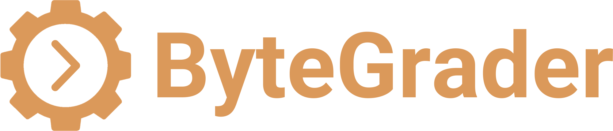

# ByteGrader Autograder Framework



**ByteGrader** is an open-source, modular autograder designed to evaluate programming assignments in embedded systems, IoT, and edge AI. Built to support a variety of programming languages, it uses containerized environments to reliably compile, run, and assess student submissions.

This project was created to streamline the grading process for technical coursework, offering:
- Flexible assignment configurations
- Support for custom test scripts and code pattern checks
- Reproducible Docker-based environments for isolation and consistency

While ByteGrader is optimized for embedded systems and hardware-centric courses, its architecture is general enough to be extended to other domains and languages.

## Key Features

- **Language-agnostic grading engine** (Python, C, etc.)
- **Docker-based execution** to isolate and reproduce environments
- **Pluggable modules** for different courses or assignments
- **Code analysis tools** to verify API usage, function calls, or design patterns

## Example Use Cases

- Grading STM32 or ESP32 firmware assignments for embedded systems courses
- Evaluating IoT device data parsing and MQTT communication tasks
- Verifying Python scripts for edge AI inference pipelines
- Ensuring students follow proper function use and coding standards

## Quick Start

_Coming soon…_

## Developing a Grader

A *grader* is a combination of Docker image and Python grading script. Every time a student submits a file (usually a *.zip* file) to a particular assignment, the *API app* spins up a container from an image built for that assignment. Start with the *graders/test-stub* grader as a boilerplate template.

Here is how you build and run the *test-stub* grader locally (with an example submission):

```sh
cd graders/test-stub/
docker build -t bytegrader-test-stub .
cd ../..
mkdir -p test/results/
docker run --rm -v "$(pwd)/test/submission-make-c-hello.zip:/submission/submission.zip:ro" -v "$(pwd)/test/results/:/results" bytegrader-test-stub
```

When you run the image, it will read in the *submission-make-c-hello.zip* file, rename to *submission.zip* in the container, process it with *grader.py*, and store the results in *test/results* as *output.json*. Note that *test-stub* does not actually build or run any submitted code. It simply verifies that the file is a *.zip* archive and returns a constant score and feedback.

## Update Process

Once the server is running, you can update ByteGrader (with minimal downtime) by logging into the server as the *bytegrader* user, stopping the container, updating the repository, and then calling the *deploy.sh* script again. Don't forget to give the script the location of your *app* directory!

```sh
ssh bytegrader@<SUBDOMAIN>.<DOMAIN>
cd ~/app
docker compose down
cd ~/bytegrader
git pull
./deploy/deploy.sh ~/app
```

Verify that the server is running with:

```sh
curl http://localhost:8080/health
```

## Test Grading

From your home/office computer (assuming you've whitelisted your public IP address), you can test submitting a dummy file for grading using the *test-stub* grader (which always returns a static grade/feedback so long as it receives a valid .zip file).

```sh
curl -X POST -H "X-API-Key: <API_KEY>" -F "file=@test/submission-make-c-hello.zip" https://<SUBDOMAIN>.<DOMAIN>/submit?assignment=test-stub
```

You should receive a "File submitted for grading" JSON message back from the server. Copy the *job_id* and check the status of the grading job:

```sh
curl -H "X-API-Key: <API_KEY>" https://<SUBDOMAIN>.<DOMAIN>/status/<JOB_ID>
```

You can watch the real-time logs of the server with:

```sh
cd /home/bytegrader/app
docker compose logs -f
```

## API Endpoints

See [the API endpoints page](/doc/api-endpoints.md) for a full list of endpoints and supported HTTP methods.

## Notes

### Check Logs

Docker Compose keeps a running set of logs. You can view them by logging into the server, navigating to the *app/* directory, and running:

```sh
cd /home/bytegrader/app/
docker compose logs
```

You can also watch logs in realtime with:

```sh
docker compose logs -f
```

### Check the Queue

You can view the queue from an approved IP address and with the correct API key:

curl -H "X-API-Key: <API_KEY>" https://<SUBDOMAIN>.<DOMAIN>/queue

### Update Go Dependences

To update Go dependencies (i.e. if you import a new package in *main.go* or want to update package listings in *go.mod* and *go.sum*), run the following:

```sh
docker run --rm -v "$PWD/server":/app -w /app golang:1.24 go mod tidy
```

### Check Go Server Syntax

If you want to do a quick build of the Go server and throw away the build artifacts to check for basic syntax and build-time errros, just run a quick Go container:

```sh
docker run --rm -v "$PWD/server":/app -w /app golang:1.24 go build -o /dev/null .
```

### Update IP Whitelist

If the server is already running and you'd like to update the white list (e.g. so you can add another client for testing), edit the environment variables:

```sh
nano /home/bytegrader/.bytegrader_env
```

Once you've added/removed the desired IP addresses, redploy (which will read in the saved environment variables from that file):

```sh
cd /home/bytegrader/bytegrader
bash deploy/deploy.sh ../app
```

Note that if you need to get the "local" IP address (what the App container sees when making calls from the host server), as `127.0.0.1` and `localhost` won't often work, you can run `docker compose logs | grep "Security check"`. This will likely be `172.18.0.0/16` so the App container can see the host.

## Todo

 * Create Arduino example
 * Make multi-stage Docker build for adding in environments (e.g. Arduino, ESP-IDF)
 * Build API for hosting site and LearnDash
 * Build loading scripts for hosting
 * Add pattern checking (i.e. did student call a particular function)
 * Add schema type checking for YAML config files
 * Set up GitHub actions for continuous testing (start with basic integration tests)
 * Construct unit tests

## License

All code, unless otherwise specified, is subject to the [3-Clause BSD License](https://opensource.org/license/bsd-3-clause).

> Copyright 2025 Shawn Hymel
>
> Redistribution and use in source and binary forms, with or without modification, are permitted provided that the following conditions are met:
>
> 1. Redistributions of source code must retain the above copyright notice, this list of conditions and the following disclaimer.
>
> 2. Redistributions in binary form must reproduce the above copyright notice, this list of conditions and the following disclaimer in the documentation and/or other materials provided with the distribution.
>
>3. Neither the name of the copyright holder nor the names of its contributors may be used to endorse or promote products derived from this software without specific prior written permission.
>
>THIS SOFTWARE IS PROVIDED BY THE COPYRIGHT HOLDERS AND CONTRIBUTORS “AS IS” AND ANY EXPRESS OR IMPLIED WARRANTIES, INCLUDING, BUT NOT LIMITED TO, THE IMPLIED WARRANTIES OF MERCHANTABILITY AND FITNESS FOR A PARTICULAR PURPOSE ARE DISCLAIMED. IN NO EVENT SHALL THE COPYRIGHT HOLDER OR CONTRIBUTORS BE LIABLE FOR ANY DIRECT, INDIRECT, INCIDENTAL, SPECIAL, EXEMPLARY, OR CONSEQUENTIAL DAMAGES (INCLUDING, BUT NOT LIMITED TO, PROCUREMENT OF SUBSTITUTE GOODS OR SERVICES; LOSS OF USE, DATA, OR PROFITS; OR BUSINESS INTERRUPTION) HOWEVER CAUSED AND ON ANY THEORY OF LIABILITY, WHETHER IN CONTRACT, STRICT LIABILITY, OR TORT (INCLUDING NEGLIGENCE OR OTHERWISE) ARISING IN ANY WAY OUT OF THE USE OF THIS SOFTWARE, EVEN IF ADVISED OF THE POSSIBILITY OF SUCH DAMAGE.
